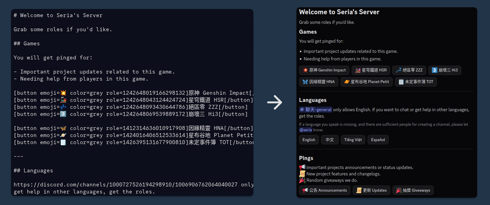

# Roler

Discord bot for easy and descriptive role management.

[>> Click to invite <<](https://discord.com/oauth2/authorize?client_id=1488089368924000367)

## Overview

Roler lets server admins write a simple markup template in any message, then turn it into a persistent role panel with clickable buttons. Members click a button to get (or lose) a role.

The special thing about Roler is its components v2 usage and flexible template system. You can create beautiful role panels mixing text messages (with markdown support) with buttons.

## Bot permissions

The bot requires the following permissions in your server:

- **Manage Roles** to assign and remove roles from members
- **Send Messages** to post role panels in channels
- **Read Message History** to fetch and update existing panels

The bot's role must be positioned **above** any role it needs to assign in the server's role hierarchy.

## Usage

### 1. Write a template

In any channel the bot can read, send a message containing your role panel template. You can wrap it in a code block (` ``` `) or write it as plain text.

A template is made up of **text lines** (rendered as panel description), **button tags**, and **separator tags**.

#### Button syntax

```
[button role=ROLE_ID]Label[/button]
```

All attributes:

| Attribute | Required | Values | Default | Description |
|-----------|----------|--------|---------|-------------|
| `role` | ✅ | Discord role ID (snowflake) | - | The role to assign/remove |
| `color` | ❌ | `blurple` `green` `red` `grey` | `blurple` | Button color |
| `mode` | ❌ | `toggle` `add` `remove` | `toggle` | How the role is applied |
| `emoji` | ❌ | Unicode emoji or custom Discord emoji | - | Emoji shown on the button |

**Modes:**

- `toggle` adds the role if the member doesn't have it, removes it if they do
- `add` always adds the role
- `remove` always removes the role

#### Custom Discord emojis

To use a custom emoji from your server (or any server the bot is in), paste the emoji's raw mention string as the `emoji` value:

```
emoji=<:emoji_name:emoji_id>
```

For animated custom emojis, prefix with `a`:

```
emoji=<a:emoji_name:emoji_id>
```

To get the raw string, type `\:emoji_name:` in Discord and send it, the message will show the full `<:name:id>` format. Copy that and use it as the attribute value.

Example:

```
[button role=1351855807167463424 emoji=<:pepe:1234567890123456789>]Pepe[/button]
[button role=1475117545122959380 emoji=<a:dance:9876543210987654321>]Dance[/button]
```

> The bot must be in a server that has access to the emoji, or the emoji must be from a server the bot shares with the user.

#### Rows

Buttons on the **same line** form one action row (up to 5 buttons per row). A **blank line** between button lines starts a new row. Up to **5 rows** are allowed per panel.

#### Separator syntax

```
[separator]
[separator size=large]
[separator size=small visible=false]
```

Alias:

```
---
```

Will translate to `[separator size=large visible=true]`.

All attributes:

| Attribute | Required | Values | Default | Description |
|-----------|----------|--------|---------|-------------|
| `size` | ❌ | `small` `large` | `large` | Spacing size of the separator |
| `visible` | ❌ | `true` `false` | `true` | Whether the divider line is visible |

### 2. Example template

```
# Welcome to role picker
## 🎨 Pick your color roles

[button role=1351855807167463424 color=red]Red[/button] [button role=1475117545122959380 color=green]Green[/button] [button role=1475119322501353564 color=blurple]Blue[/button]

-# Note: Ask admin if you want other colors.

---

## 🎮 Gaming roles

[button role=1483649491885097040 color=grey mode=add]Genshin Impact[/button]

[button role=1484415034753810482 color=grey mode=add]Honkai: Star Rail[/button]
```

### 3. Create the panel

Right-click (or long-press on mobile) the message containing your template → **Apps** → **Roler** → **Create Role Panel**.

A channel picker will appear. Select the channel where the panel should be posted. The bot will validate your template and send the panel there.

> Requires the **Manage Roles** permission.

### 4. Update the panel

Edit your original template message. The bot automatically detects the edit, re-parses the template, and updates the live panel. If the edited template has errors, the bot will DM you with the details and leave the existing panel unchanged.

### 5. Delete the panel

Right-click the original template message **or** the live panel message → **Apps** → **Roler** → **Delete Role Panel**.

The bot removes the panel message and cleans up its database record.

> Requires the **Manage Roles** permission.

## Template validation rules

The bot will reject a template and show an error if:

- A button is missing a valid `role` ID
- A button has neither a label nor an `emoji`
- A row contains more than **5 buttons**
- The template contains more than **5 rows**

## Self-Hosting

### Requirements

- Python 3.14+
- PostgreSQL

### Environment variables

Create a `.env` file in the project root:

```env
DISCORD_TOKEN=your_bot_token
ENV=prod

POSTGRES_PASSWORD=your_password
POSTGRES_DB=roler
POSTGRES_HOST=localhost
POSTGRES_PORT=5432
POSTGRES_USER=postgres
```

### Running locally

```bash
uv sync
uv run main.py
```

### Running with Docker

```bash
docker build -t roler .
docker run --env-file .env roler
```
